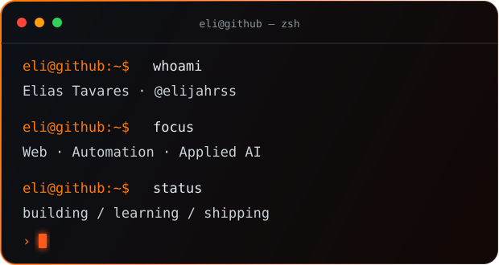

  

 

  
  
  

 

<table>
  <tr>
    <td width="55%" valign="top">
      <h2>Olá — I'm Elias.</h2>
      

        I'm a developer in progress from <strong>Salvador, Bahia, Brazil</strong>, turning curiosity into interfaces, automations and AI-powered experiments.
      

      

        I learn by building: every project is a reason to understand the fundamentals more deeply, solve a real problem and ship something people can actually use.
      

      

        <strong>Current direction:</strong> web development, automation, applied AI and Lua/Luau.
      

      <blockquote>
        I don't wait to know everything before I build — I build to discover what I still need to know.
      </blockquote>
    </td>
    <td width="45%" valign="top">
      
    </td>
  </tr>
</table>

## What I'm building toward

<table>
  <tr>
    <td width="50%" valign="top">
      <h3>⚡ Useful experiences</h3>
      
Responsive interfaces with strong visual identity, purposeful motion and clear interaction.

    </td>
    <td width="50%" valign="top">
      <h3>⚙️ Smarter workflows</h3>
      
Automation and AI prototypes that remove repetitive work and turn ideas into repeatable systems.

    </td>
  </tr>
  <tr>
    <td width="50%" valign="top">
      <h3>🧠 Strong foundations</h3>
      
Clean code, Git, APIs, debugging, documentation and the engineering habits behind reliable software.

    </td>
    <td width="50%" valign="top">
      <h3>🚀 Real-world growth</h3>
      
Shipping public work, learning in the open and preparing for my first professional opportunity in tech.

    </td>
  </tr>
</table>

## Toolbox

  <strong>Working with</strong>  
  

  <strong>Currently learning</strong>  
  

## Selected work

<table>
  <tr>
    <td width="50%" valign="top">
      <h3><a href="https://github.com/elijahrss/Cipriano">Grimório Noturno</a></h3>
      
A multi-page cultural encyclopedia with an immersive editorial identity, responsive navigation and rich long-form content.

      
<code>HTML</code> <code>CSS</code> <code>JavaScript</code>

    </td>
    <td width="50%" valign="top">
      <h3><a href="https://github.com/elijahrss/bko">Medicina Nuclear</a></h3>
      
An interactive educational experience with responsive sections, animated visuals, structured data and a high-contrast design system.

      
<code>HTML</code> <code>CSS</code> <code>JavaScript</code>

    </td>
  </tr>
  <tr>
    <td width="50%" valign="top">
      <h3><a href="https://github.com/elijahrss/jess">Interactive Web Letter</a></h3>
      
A creative front-end piece built around typography, animation and an interactive reveal.

      
<code>HTML</code> <code>CSS Animation</code> <code>JavaScript</code>

    </td>
    <td width="50%" valign="top">
      <h3><a href="https://github.com/elijahrss/elijahrss">Profile System</a></h3>
      
The visual system behind this profile: original animated SVGs, focused content hierarchy and automated contribution artwork.

      
<code>SVG</code> <code>Markdown</code> <code>GitHub Actions</code>

    </td>
  </tr>
</table>

## GitHub pulse

  
  

 

  

 

  

## Contribution trail

<picture>
  <source media="(prefers-color-scheme: dark)" srcset="https://raw.githubusercontent.com/elijahrss/elijahrss/output/github-contribution-grid-snake-dark.svg" />
  <source media="(prefers-color-scheme: light)" srcset="https://raw.githubusercontent.com/elijahrss/elijahrss/output/github-contribution-grid-snake.svg" />
  
</picture>

  
<strong>A little more beyond the code</strong>

   
  Games trained my persistence, music feeds the creative side, and curiosity keeps sending me down wonderfully random rabbit holes. I want to turn that mix into useful software, clear tutorials and projects with personality.

---

  <strong>Curiosity starts the engine. Consistency gets it across the finish line.</strong>
   
  Open to learning, collaboration and first opportunities in technology.

